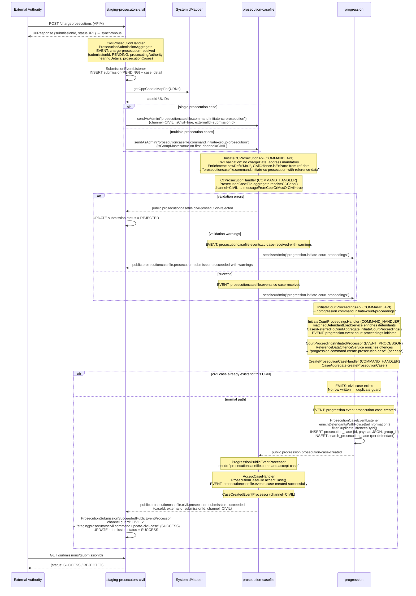

# CLAUDE.md

This file provides guidance to Claude Code (claude.ai/code) when working with code in this repository.

## Project Overview

This is the **civil prosecution staging service** — the inbound gateway that receives civil criminal case submissions from external prosecution authorities via Azure APIM and mediates them into `cpp-context-prosecution-casefile` (PCF). It handles two pathways:

- **Charge**: existing case with a URN + hearing date
- **Summons**: warrant-style submission without prior charge

Each submission is tracked through states: `PENDING` → `SUCCESS` / `SUCCESS_WITH_WARNINGS` / `REJECTED`. Callers receive a `submissionId` synchronously and poll a query endpoint for status.

## Build Commands

```bash
# Full build + unit tests
mvn clean install

# Skip tests
mvn install -DskipTests

# Unit tests only
mvn test

# Single module test
mvn -pl stagingprosecutorscivil-command/stagingprosecutorscivil-command-api test

# Single test class
mvn test -Dtest=CivilProsecutionApiTest

# Integration tests (requires Docker + CPP_DOCKER_DIR env var)
./runIntegrationTests.sh

# Viewstore Liquibase migrations (local dev, no Docker)
./runLiquibase.sh

# JMX system commands against local WildFly
./runSystemCommand.sh --list
./runSystemCommand.sh CATCHUP
```

## Module Layout

```
stagingprosecutorscivil-command/
  stagingprosecutorscivil-command-api         COMMAND_API — REST entry, assigns submissionId, returns statusURL
  stagingprosecutorscivil-command-handler     COMMAND_HANDLER — loads aggregate, emits domain events

stagingprosecutorscivil-domain/
  stagingprosecutorscivil-domain-aggregate    ProsecutionSubmissionAggregate
  stagingprosecutorscivil-datatypes-common    Shared data types
  stagingprosecutorscivil-domain-common       Shared utilities
  stagingprosecutorscivil-domain-message      Message payload definitions

stagingprosecutorscivil-event/
  stagingprosecutorscivil-event-listener      EVENT_LISTENER — persists submission state to viewstore
  stagingprosecutorscivil-event-processor     EVENT_PROCESSOR — sends PCF commands + updates status (3 processors)

stagingprosecutorscivil-event-sources         YAML topic/queue declarations
stagingprosecutorscivil-query/
  stagingprosecutorscivil-query-api           QUERY_API — GET /submissions/{submissionId}
  stagingprosecutorscivil-query-view          QUERY_VIEW — queries SubmissionRepository

stagingprosecutorscivil-viewstore/
  stagingprosecutorscivil-viewstore-liquibase    DB schema migrations
  stagingprosecutorscivil-viewstore-persistance  JPA entities (Submission + CaseDetail), SubmissionRepository

stagingprosecutorscivil-apim-policy           Azure APIM OpenAPI v3 spec + XML policies per operation
stagingprosecutorscivil-healthchecks          Health endpoints
stagingprosecutorscivil-integration-test      Full-stack ITs
stagingprosecutorscivil-service               WAR assembly
```

## Data Flow

```
External Authority
  → POST /chargeprosecutions or /summonsprosecutions (via APIM)
  → CivilProsecutionApi (COMMAND_API)
      Synchronously returns UrlResponse { statusURL, submissionId }
  → CivilProsecutionHandler (COMMAND_HANDLER)
      ProsecutionSubmissionAggregate emits:
        stagingprosecutorscivil.event.charge-prosecution-received
        OR stagingprosecutorscivil.event.summons-prosecution-received

  ┌─ EVENT_LISTENER: SubmissionEventListener
  │   Persists Submission(PENDING) + CaseDetail rows to viewstore
  │
  └─ EVENT_PROCESSOR: ProsecutionChargedEventProcessor
      Looks up CPP case IDs via SystemIdMapperService (external URN → UUID)
      If 1 case:  sendAsAdmin → prosecutioncasefile.command.initiate-cc-prosecution
      If N cases: sendAsAdmin → prosecutioncasefile.command.initiate-group-prosecution
                               (first element marked isGroupMaster=true)
      Sends stagingprosecutorscivil.command.update-civil-case (status=PENDING)

  ← public.event (from PCF context):
      public.prosecutioncasefile.civil.prosecution-submission-succeeded
      public.prosecutioncasefile.prosecution-submission-succeeded-with-warnings
      public.prosecutioncasefile.group-submission-succeeded
      public.prosecutioncasefile.civil-prosecution-rejected
      public.prosecutioncasefile.group-prosecution-rejected

  → EVENT_PROCESSOR (filters Channel=CIVIL, ignores other channels)
      Sends stagingprosecutorscivil.command.update-civil-case (status=SUCCESS/REJECTED/etc.)

  → EVENT_LISTENER: SubmissionEventListener.updatedCivilCaseReceived
      Updates Submission status + errors/warnings in viewstore

Caller polls:
  GET /submissions/{submissionId} → CivilProsecutionQueryApi → SubmissionRepository
```

## Event Sources

- **Own topic**: `jms:topic:stagingprosecutorscivil.event`
- **Subscribed**: `jms:topic:public.event` (PCF public events only, filtered by `Channel.CIVIL`)

**Internal events emitted:**
- `stagingprosecutorscivil.event.charge-prosecution-received`
- `stagingprosecutorscivil.event.summons-prosecution-received`
- `stagingprosecutorscivil.event.update-civil-case-received`

**Commands sent to PCF (as admin):**
- `prosecutioncasefile.command.initiate-cc-prosecution` (single case)
- `prosecutioncasefile.command.initiate-group-prosecution` (multiple cases)

## Viewstore Schema

- `submission` table: `submission_id`, `submission_status`, `ou_code`, `received_at`, `completed_at`, `errors`, `warnings`, `case_errors`, `defendant_errors`, `case_warnings`, `defendant_warnings` (JsonArray columns via `JsonArrayConverter`)
- `case_detail` table: `id`, `case_urn`, FK to `submission`

## Key Conventions

- **Synchronous response from async system**: Unlike typical CQRS services, `CivilProsecutionApi` returns `UrlResponse` (with `statusURL` + `submissionId`) synchronously in the POST response. The actual processing is async; callers must poll.
- **Channel filtering**: All event processors guard on `Channel.CIVIL` and silently drop non-civil events. PCF emits events for criminal cases on the same `public.event` topic.
- **`sendAsAdmin()`**: Commands to PCF are dispatched as admin because the originating user context (prosecution authority) doesn't hold PCF-side authorisation.
- **System ID Mapper**: `SystemIdMapperService` resolves external prosecution authority URNs to CPP-internal case UUIDs before forwarding to PCF.
- **APIM contract**: `stagingprosecutorscivil-apim-policy/` holds the OpenAPI v3 spec and XML policies for the external-facing surface. This is the authoritative contract for external consumers — keep it in sync with handler behaviour.
- **Version pins**: Tightly coupled to `prosecutioncasefile.version` and `referencedata.version` — bump both in `pom.xml` together and verify schema classifier deps match.
- **No Spring**: CDI/JEE only — `@Inject`, `@ApplicationScoped`, `@ServiceComponent`, `@Handles`.

## Enforcement Case Creation — Full Sequence Diagram

"Enforcement" cases are civil cases (civil offence codes, `isCivil=true`). They travel the charge prosecution pathway — there is no separate enforcement code path.



## CI/CD

- **Azure Pipelines** (`azure-pipelines.yaml`): agent `MDV-ADO-AGENT-AKS-01` (CentOS 8, Java 17)
  - PR trigger → `context-verify.yaml` (SonarQube)
  - Push to `main` / `team/*` → `context-validation.yaml` (full build + ITs + AKS deploy)
  - SonarQube project key: `uk.gov.moj.cpp.stagingprosecutorscivil:stagingprosecutorscivil-parent`
- **GitHub Actions**: GitLeaks secret scan on all PRs + weekly Thursday schedule
- **Docker**: `docker/Dockerfile_stagingprosecutorscivil-service` for the WildFly WAR image
